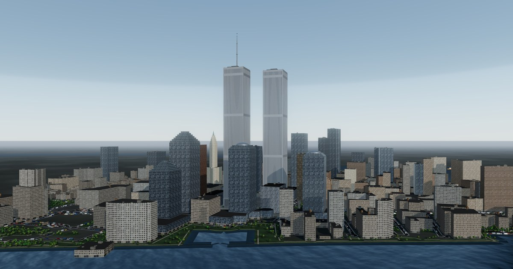
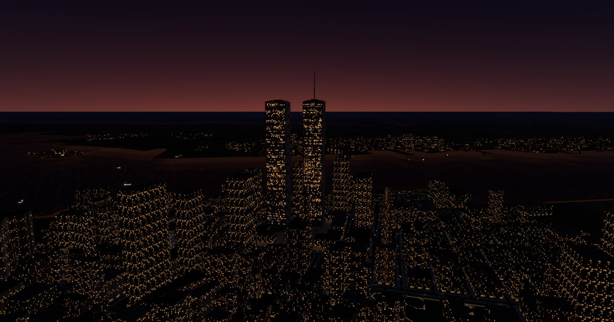

# World Trade Center 2001

**A 3D reconstruction of the World Trade Center and Lower Manhattan.**

A browser-based 3D reconstruction of the World Trade Center and Lower
Manhattan in 2001.

**→ [wtc.eugeneyip.net](https://wtc.eugeneyip.net/)**

<sub>Also reachable at [eugeneyip.github.io/wtc-2001](https://eugeneyip.github.io/wtc-2001/), which redirects here.</sub>



The Twin Towers and the neighbourhood around them as they stood in September
2001. The towers are reconstructed from published dimensions; everything
around them is real building footprint and street geometry from
OpenStreetMap, curated back to how the area looked that year.

> Twenty-five years on. In memory of everyone lost at the World Trade Center
> on 11 September 2001.

## Run it

Open the site above, or run it locally:

```bash
python3 -m http.server 8791
```

then open <http://127.0.0.1:8791/index.html>.

There is also `wtc.html` — the whole thing inlined into a single file, no
server and no network needed. Download it and open it directly.

Drag to orbit, scroll to zoom, right-drag to pan. Keys `1`–`6` jump between
viewpoints, `L` toggles labels. The slider moves the sun through the day. On
a phone or tablet the controls become a bottom sheet; drag the handle up.

## What's modelled

**The towers.** Not clad boxes — their appearance came almost entirely from
the facade, so that is what is modelled. Each tower carries 59 aluminium-clad
columns per face standing 0.36 m proud of the glass line, which is why they
read as solid silver from any oblique angle and showed their windows only
head-on. At the base each column forked into a three-storey "trident",
producing the pointed arcade at plaza level; that is pierced geometry, not a
texture. Mechanical floors (7–8, 41–42, 75–76, 108–110) read as solid bands,
and 1 WTC carries its 360 ft transmission mast, added in 1978.

The columns are one box each running the whole shaft, and for a long time that
meant a tower had **no horizontal scale in it anywhere**: from the plaza it was
110 storeys of uninterrupted vertical line, and nothing in the frame said how
tall a line that was. The glass behind them does carry a spandrel at every
floor — but the columns stand 0.36 m proud of it and hide the lot at any angle
off square, which is exactly the property that makes the building work.

So the spandrel goes on the column face, where the real one was: an aluminium
plate spanning between the covers, set back far enough to sit a shade darker.
It is keyed off world height rather than off the geometry, because the shaft is
a single box with nothing in its UVs to key from, and it is band-limited on the
way out. A 3.66 m period on a 417 m building is under a pixel from anywhere
useful, and left alone it beats against the pixel grid into slow horizontal
bands crawling up the tower; `fwidth` says how much of a floor one pixel
covers, and once that is half of one the whole thing is gone and the column is
plain metal again — which is what it should average to.

**One artefact left, and it is the geometry.** Standing close and looking along
a face rather than at it, the columns break into a herringbone of chevrons.
Measured rather than guessed at: hiding the column instances removes it
entirely and the face goes smooth, removing the glass texture behind them
changes nothing, and turning shadows off changes nothing. It is 59 columns on a
1.016 m pitch going sub-pixel at a grazing angle, beating against the sample
grid — and 4× multisampling cannot fix a *periodic* pattern, because the sample
positions are periodic too. The honest fixes are temporal antialiasing or
supersampling, neither of which is on the table here. It does not appear in any
of the six viewpoints; you have to drive the camera to it.

| | |
|---|---|
| Footprint | 208 × 208 ft (63.40 m) |
| Column pitch | 3 ft 4 in (1.016 m) |
| 1 WTC roof | 1,368 ft (417.0 m), 110 floors |
| 1 WTC to mast tip | 1,728 ft (526.7 m) |
| 2 WTC roof | 1,362 ft (415.1 m), 110 floors |
| Gap between towers | 130 ft (40 m) |
| Site | 16 acres |

**The complex.** All seven buildings: the two towers, 3 WTC (the Marriott),
the low-rise 4, 5 and 6 WTC wrapping the plaza, and the original 47-storey
7 WTC north of Vesey Street — which stood east of its 2006 replacement, over
ground where Greenwich Street now runs. Austin J. Tobin Plaza is raised 4.3 m
above street grade, walled at its edge, with Fritz Koenig's *Sphere* on its
fountain.

The deck is not a blank apron. Its granite was laid in courses struck from the
fountain, and that pattern is round, so it cannot come from a tiling map: it is
computed from the distance to the centre in the shader, which also clips it to
the deck for nothing. The Sphere stands on a plinth in a pool with a granite
kerb round it, rather than on the dark disc it used to sit on.

The towers' facade columns run on past the top floor as a parapet. That is what
gave them their hard upper edge, and what kept the roof plant out of sight from
below; cut off level with the deck, the roofline went soft and the mechanical
houses sat out in the open. The obstruction lights stand on the parapet.

Two flights climb to the deck, each in the only stretch of its frontage that
is not a building: a broad one from Liberty Street, centred on the South
Tower, and the Vesey Street stair on the north — the **Survivors' Staircase**,
which carried hundreds of people off the site on 11 September and was the last
original structure left standing above ground there, moved into the memorial
museum in 2008. It is modelled as it was, steps beside a bank of escalators,
on the line Greenwich Street would take through the site.

**Roads through buildings.** Some of the streets ran straight through the
blocks, and once the traffic started driving there were cars inside buildings.
Measured: 3.9% of all road centreline samples were inside a footprint, across
58 of the 753 roads.

The cause turned out to be one tag. A carriageway is a line, but OSM also uses
`highway=pedestrian` for plazas, forecourts and the paving around a building,
drawn as closed rings or tagged `area=yes` — and **657 of the 694 pedestrian
ways in this extract are areas, not streets.** Drawn as roads they came out as
nine-metre ribbons looping back on themselves through the middle of buildings,
with kerbs, lane markings, parked cars and moving traffic on them. Nearly five
hundred of them are the paving of the modern memorial site, which this model
does not have anyway.

So: a closed pedestrian way, or anything tagged as an area, is not a
carriageway and is dropped. What remains is then clipped out of the building
footprints, but only where a centreline runs more than 2.5 m inside one — that
is wider than the usual disagreement between where OSM puts a wall and where it
puts the kerb, and narrower than any building worth the name, so real streets
are not chopped into pieces by a metre of mapping slop.

| | before | after |
|---|---|---|
| centreline inside a building | 3.93% | 0.41% |
| roads touching a building | 58 | 10 |
| moving cars inside a building | 1.1% | 0.17% |
| parked cars inside a building | — | 0 of 2,964 |

(Those two vehicle figures are measured against the ordinary building
footprints, like for like with the earlier one. Counting the WTC complex
footprints as well — the plaza deck edges among them — it is 3 moving and 7
parked out of 3,566, which is 0.28%.)

The check that mattered was making sure this removed plazas and not streets.
Road length by class, before and after: residential and unclassified 22,420 m
to 22,325 m, tertiary 320 m to 320 m, secondary 7,024 m to 7,024 m, primary
1,497 m to 1,497 m, trunk 2,498 m to 2,498 m. **Every classified street is
untouched.** The whole of the 15.3 km that went was pedestrian paving, leaving
the 1.7 km of genuinely pedestrianised street — Wall Street, Exchange Place,
New Street and the rest — still there.

**Streets.** The OSM width is the whole right of way, so the carriageway is
narrowed and the remainder becomes pavement either side, with lane markings
down the middle. Lamp standards line both sides, alternating, with a few more
around the plaza deck.

**The kerb, and why there wasn't one.** Everything on the ground here used to
live inside ten centimetres of everything else — land, pavement, parks, inland
water, asphalt — because those numbers were never heights, only an order for
deciding which surface won a depth fight. And the order had the **carriageway
six centimetres above the pavement beside it**: backwards, invisible from
anywhere except the one place a street is actually looked at, and the reason
the kerb had to be a dark line painted into the road texture.

The obstacle was real and it is measurable. A wide avenue is often several
parallel ways in the data, and every junction is two carriageways crossing, so
a pavement laid at its full width runs over its neighbour's roadway: **12 per
cent of the pavement in this extract sits on top of another road's
carriageway**. At four centimetres nobody sees that. At a kerb's height it is a
slab laid across the street.

So the pavement is now told where to stop. The carriageways go into a coarse
grid; each pavement strip is tested every metre and a half — along the kerb
line, because that is the edge that shows, and along its far edge, because a
wide pavement reaches across the next street if nobody stops it — and the runs
that survive are merged back into one quad each. Cutting at a metre and a half
and merging afterwards costs **3,366 triangles** for the whole city's pavement,
which is less than the uncut version used.

Two things fell out of it. The pavement can now be run out past the width the
road data gives it — a fifth of the right of way was 2 to 4 m, and it left bare
ground between the paving and the building line over much of the grid — because
anything that overreaches is cut. And the land beneath sits six centimetres
under the carriageway rather than under the pavement, so the pockets at a
junction corner that neither pavement can reach read as road surface rather
than as holes in it.

**Traffic.** Which side of the centreline a vehicle sits on and which way it
faces are one decision, not two. They used to be taken separately — the side at
random, the heading always along the way — so half the cars in the city were in
the oncoming lane. Keeping right settles both.

The kerb lane is a continuous rank of parked cars, which is what a street down
here looks like and what the roadway was missing; without it the asphalt read
as an apron. Most of this grid is a nine or eleven metre right of way, which
after its pavements leaves five or six metres: one parking lane and one travel
lane, so those streets are parked one side only. The rank is dense inside a
radius and simply absent outside it, because a rank is only worth having if it
is continuous. Nothing parked is a cab. Among the moving traffic there are step
vans and buses as well as cars, and a slot may carry a second vehicle close
behind the first, because traffic bunches at the lights rather than spacing
itself evenly.

**What makes a vehicle read as one.** Every car, van and bus was two or three
flat-sided boxes sitting on the road with nothing under them, and from across
the street a rank of parked cars was a row of shipping containers. What a
vehicle needs is not detail; it is two things in the silhouette. It has to be
**up on wheels**, with daylight under the sills and a gap between the axles.
And it has to **narrow towards the roof** — a tuck-in on the body sides and the
rake of a windscreen and a backlight, which is most of what tells a car from a
crate at any distance at all.

The wheels are one dark block per axle running the full width rather than four
separate ones. Down the side — which is every view of a parked car there is —
the two are identical, and it halves what wheels cost on three thousand
instances. Square on from in front, low down, the block reads as solid where
two wheels should be; there is no light under there to give it away.

**And the boats were rafts.** A vessel was a single cuboid with the bow corners
pulled in: twelve triangles, and from anywhere close it read as a piece of dock
that had come adrift. A boat is not hard to suggest — a stem that rakes
forward, a beam widest amidships and gone by the bow, a flat transom, and a
sheer that lifts at both ends. Built as stations along the length, which is how
a hull is faired anyway, it comes to thirty-four triangles, and there are only
thirty-eight boats.

Two things about it were wrong the first time and both are worth the note. The
two sides of a hull are mirror images, so **one of them has to be wound the
other way round**; taken on trust, the whole starboard side faced inward and
was culled, and a hull with one side missing looks exactly like a hull sitting
too low in the water. And the deck cannot be greyed down inside the hull
geometry, because a vertex colour *multiplies* the instance colour: on an
orange boat it gives a dark orange deck, which is still a raft. The deck is a
mesh of its own, and one more instanced draw for the whole harbour.

The hulls also sit at their marks now. Their base was a fixed −1.1 m, which was
three tenths of a metre of draught when the sea was at −0.55 and less than that
once the ground levels were sorted out. Draught goes with size.

All of it costs 213,000 triangles and one draw call, on a frame that was
already established as fill-bound rather than geometry-bound.

Junctions come free: OpenStreetMap splits ways where they meet, so the ends of
the ways *are* the junctions and no intersection test is needed. Every crossing
of two real streets gets painted crosswalks and a stop bar on each approach —
two transverse lines rather than the ladder bars that came later, which is what
nearly every crossing down here had in 2001 — and two diagonally opposite
corners get a signal on a mast arm, red on one axis and green on the other.
Hydrants and litter bins stand along the kerb, because without something
knee-high there is nothing in the frame between a lamp standard and a car and
the pavement reads as a blank apron.

**Traffic that moves.** For a long time the cars did not. Six hundred vehicles
were placed on the streets at build time and never touched again — a city
photographed rather than running.

They drive now, along the road they were put on, following its bends. The
awkward part is that OpenStreetMap splits its ways at every junction, so the
roads here have a median length of 49 m: a car crossing one in six seconds
would spend its life starting over. So only vehicles on a road of 90 m or more
move at all, and the rest stand. That is not a dodge. At any moment a good deal
of the traffic in Lower Manhattan is stopped, and a side street of waiting cars
beside an avenue that is flowing is what the place actually looks like. Where a
vehicle does run out of road it shrinks away over the last few metres and grows
back at the far end, so the moment it goes round reads as a car leaving the end
of a street rather than blinking from one kerb to the other.

Speeds are 4.6 to 8.8 m/s — 17 to 32 km/h, which is what that grid manages.
509 of the 586 vehicles are moving, and driving them costs 0.37 ms a frame.

**Flags.** Where they are is invented, the same way the trees and the roof
plant are: there is no survey of which buildings down here flew one, so they
are scattered from a fixed seed across flat roofs between 22 and 200 m. What is
not invented is the size, which is the thing that usually goes wrong. A
commercial rooftop pole is about eight metres with a five by nine foot flag on
it — 1.52 m by 2.84 m — and the official proportions are a fly 1.9 times the
hoist with the union seven stripes tall and two fifths of the fly wide. Drawn
at the size the eye remembers from photographs they come out as bedsheets.

The wind is a travelling sine in the vertex shader, growing from nothing at the
hoist to its full throw at the fly, with a slower second wave across it so the
cloth is not corrugated iron; each flag takes its phase from where it stands so
they do not all snap together. The stars are a staggered grid of dots — at a
couple of metres of cloth two hundred metres off they are three or four pixels,
and the alternative was a blue rectangle that reads as a blank.

One consequence worth writing down: the wave lives in the cloth's own vertex
shader, and the depth material the shadow pass uses knows nothing about it, so
a flag would have thrown the shadow of the flat quad it started as. The flags
do not cast. At that size the shadow is worth nothing and a wrong one is worth
less.

**Parks.** The green was a single flat colour, which from the air read as
billiard cloth cut to shape rather than as ground — and it was the most
saturated thing in the frame, so the eye went to the parks before the city. The
grass is mown turf with worn ground showing through where it would: never one
colour anywhere.

The larger parks get a walk a few metres inside their boundary, following it
round. Nothing is routed: it is what the main walk in a small city park does
anyway, and it needs no more than the polygon already in the data. City Hall
Park and Battery Park are more path than lawn, and with none at all they were
just fields.

Foliage varies tree by tree, a little of it already turning in early September.

**Ground floors.** Every building used to run its upper-floor window grid
straight into the pavement, which is the one thing a street will not survive: a
street is read from its ground floor, and a ground floor is nothing like the
floors above it. It is taller, mostly glass, set behind a plinth and under a
fascia, and interrupted every few metres by a stone pier. So the bottom five
metres of every building tall enough to have a proper ground storey is a band
of its own, standing a hand's breadth proud of the wall behind — which is what
a base course does anyway. It is built by hand rather than extruded, because
the run along the perimeter has to be true arc length for the shopfront bays to
keep their width around a corner, and the tile has to be anchored at the
pavement so the plinth is always at the bottom.

**Around it.** 814 building footprints, the street grid, the Hudson and East
rivers and the harbour out to about fifteen kilometres, and the parks. Cesar Pelli's World Financial Center
towers with their dome and stepped-pyramid crowns, the Woolworth Building,
One Liberty Plaza, the Barclay-Vesey Building, and the Deutsche Bank Building
at 130 Liberty Street — damaged on 9/11 and since demolished, so re-added by
hand.

**Roofs.** Every roof in the city was the darkest surface in the frame at
noon — which is when they are the ones facing the sun most squarely. Measured:
the roof texture had a linear albedo of 0.046, and the per-building tint on top
of it took that to **0.033 effective**. Three per cent, darker than fresh
asphalt. Tar-and-gravel roofs, which is what nearly all of these had, run 0.10
to 0.20, and plenty were ballasted with pale gravel or painted with aluminium.

It showed up twice over. The rooftop plant is 0.141 — **four times as bright as
the roof it was standing on** — so the mechanical units and stair overruns read
as polystyrene blocks scattered over black felt.

The first attempt simply lifted the texture until the effective albedo was
0.102, which is a perfectly good number and looked wrong: every roof in the
city came out the same pale grey and the place read as poured concrete from
above. Uniformity turned out to be as much of the problem as level, and the old
darkness had been hiding it. A roofscape is a patchwork — black membrane beside
pale gravel beside aluminium paint — so roofs now take their own tone per
building, seeded off the footprint and squared so that dark is commoner than
pale. They span **0.047 to 0.162 with a mean of 0.083**, and the plant now sits
at 1.06 times its roof instead of 4.3.

Uniformity came back a second time, in a different place. The tone varies
building to building; it did not vary *within* a roof, because everything on
the texture was small — gravel a few centimetres across, lapped seams every
couple of metres — and all of that is below a pixel by the time a roof is two
hundred metres off. It mipped away to one flat tone, and from above the city
was a field of grey plates with the per-building tint the only thing separating
them. The tile is now 18 m rather than 9, and carries patches at three to nine
metres: recoating, repairs, where the water stands. Metres are the one scale
that survives the distance a roof is actually seen from.

And five roofs were **pure black**, which took a while to see for what it was.
The WTC complex builds its own roofs and pools them onto the same tar-and-
gravel material as the rest of the city — but that material reads a vertex
colour, and geometry that does not carry one gets zero for it. Not dark: zero.
Five flat black rectangles in the middle of the model, one of them with a flag
flying over it. They take the same per-building spread the rest of the roofs do
now.

Three things checked and left alone. Parapets already exist, at 0.85 m, which
is why the clutter is placed 0.8 m down. Water tanks were already there — a
staved drum with a conical cap on legs, on buildings between 18 and 75 m.
And the heights are better sourced than expected: of the 971 buildings in the
extract, 797 carry an explicit OSM height and 28 more give storey counts, so
only 15% fall back on the estimate. There is also one apparent pencil — 169 m
standing on a 234 m² footprint, sharing its height with a 2,251 m² neighbour,
which is one building mapped as two ways. Gone to look at it, it reads as a
wing of the tower's massing rather than a spike beside it, so it stays. Six
such fragments exist city-wide and the rest are between 10 and 30 m.

**Facades.** Roughness and metalness vary *within* a facade, not just between
buildings, so glass behaves like glass: dark head-on, where a dielectric
returns four per cent of what falls on it, and bright at a glancing angle
where it returns nearly all of it. Sharing one roughness between stone and
window meant every window in the city was a hole punched in a wall. Behind the
glass the rooms differ — blinds half down in one, a net curtain in the next,
an empty office after that — because a bay filled with a single colour reads
from the pavement as a luminous sticker.

Seven facade families cover 814 buildings, so each building also carries a
small tint of its own, seeded from its footprint. Without it a block of the
same class is one extruded mass in one colour; with it no two neighbours are
quite the same stone, which is the actual condition of a district built a few
buildings at a time over a century. Two buildings are too well known to leave
to that — the Woolworth and the American Surety, both clad in pale terracotta
rather than the brownstone around them — so they are given a facade family
instead of a tint, because multiplying a colour lightens it without ever
desaturating it.

**The walls have depth in them.** Every wall in this model was a flat plane
with its windows painted on, and the giveaway was the shadow: each opening had
a dark line drawn down its left side, and that line pointed the same way at
nine in the morning and at six at night. A facade went dead the moment the sun
came off it, because there was nothing there for the light to find.

So the same drawing is made twice — once in colour, once in depth — and the
depth becomes a normal map. Window glazing sits back about a foot in its
opening, sills and mullions and spandrel bands stand proud, and the reveal
throws a real shadow that turns through the day. The height field is kept in
metres rather than in an arbitrary strength, which is what stops a reveal
being deeper in a 3.2 m bay than in a 1.6 m one.

Three things had to be got right about it:

- **Strength.** At full it read as quilting: a warm highlight all the way
  round every opening and a wall that looked pressed rather than cut. A third
  gives a lit edge on the sun side and a dark one opposite, which is what a
  reveal actually is.
- **Sharpness.** A step drawn on one texel is a wall that turns ninety degrees
  in nothing, and it crawls as the camera moves. Under a texel of blur is
  enough to chamfer it; at two the openings stopped reading as holes cut in
  masonry and started reading as dents pressed into putty.
- **The painted shadow had to come down**, from 0.30 to 0.16, or the two
  doubled up. What is left of it is the ambient occlusion of a deep opening,
  which a normal map cannot give.

The shopfronts got the same treatment, and had to: they are the wall closest
to anyone standing on the pavement, and a relieved wall sitting on a flat
painted ground floor is worse than neither.

**And weathering.** From a few hundred metres up a block used to read as a
punched card — identical holes in an even field, with nothing happening
between them. What happens between them is dirt. Rain runs off a sill and
takes the soot on the wall with it, so a masonry building carries a streak
under most of its openings, a little different in length and darkness each
time, and a few longer stains running most of its height. That, more than any
amount of window detail, is what tells you it is a building and not a pattern.
Curtain wall sheds water at the spandrel instead, so the ribbon-glazed
families get the long stains and no sill streaks.

**Relief.** The land across the rivers was a table — a flat plane meeting the
sky in a ruled horizontal line, which no real shore does, and the eye files
that under mudflat rather than New Jersey.

The high ground is not invented. OpenStreetMap carries the named hills around
the harbour with real elevations on them — Todt Hill at 125 m, Battle Hill over
Green-Wood, Laurel Hill behind Secaucus — and the Palisades are mapped as a
cliff line. Those put hills where the hills are. Between them the ground
undulates gently, and that part carries no claim; it is kept modest on purpose,
because the near shores of this harbour really are low and flat and giving
Jersey City a mountain range would be a worse lie than the table it replaces.

It also has to stay off this island, which took far too long to notice. The
land mask is built from the coastline, and Manhattan is land: so the relief was
generated over Lower Manhattan too, and the inland blur that decides how far
from the water you are made the middle of the island count as thoroughly
inland. The result was an invented hill under the city — 2.5 m at the WTC site,
6 m half a kilometre out, 10 m at a kilometre — carrying the grey ground
material, sitting above the roads. The buildings were tall enough to poke
through it, so what you saw was a sheet of grey filling every street, and
whether it hid the road depended on the angle you looked from. Rendered in red
over an aerial view, it was the entire street grid.

Even at zero height it would have been wrong: a relief cell over the city sits
two centimetres above the flat ground and fights it for depth. So the relief
now finds the ring the origin is standing in and is not generated inside it at
all. That is 2,722 triangles saved and the closest relief vertex to the towers
goes from 14 m to 1.7 km, which is the far side of the river, where it belongs.

Worth saying plainly: this arrived with the relief and was not caught when it
did. The checks then were all about the far shore and the coastline — whether
the horizon was broken and whether the pier fingers survived — and none of them
looked at what the new surface was doing to the ground underfoot.

It is a separate surface laid a couple of centimetres over the flat land rather
than a displacement of it. The coastline is the most carefully built thing in
this model and is accurate to a few metres; a grid coarse enough to afford
would have chewed it up. So the height ramps to nothing before it reaches the
water, and the last few hundred metres of every shore are still the exact flat
ground underneath. From a low camera the effect is small, and correctly so: a
coastal plain seen from ninety metres up really does present an almost straight
horizon. From the towers, where you look down on the land, it is the difference
between terrain and a plate.

**The bridge, looked at properly.** Three things were wrong with it, all of
them the kind that only show when you go and stand next to the thing.

The main cables were drawn 0.84 m across. The real ones are 15¾ inches — 0.40 m
— and the file said so in its own header while the code used twice that, so up
close they were plainly pipes. They are 0.54 m now, which is still half again
life size and is written down as a drawing allowance rather than a measurement:
at the kilometre this bridge is normally seen from, 0.40 m is about a third of
a pixel, and a cable that thin shimmers in and out of existence instead of
reading as a line.

The necklace lamps were metre-wide spheres in near-white, which at noon made
the cables look strung with golf balls. A globe on that necklace is about a
foot across, and the fixtures themselves are painted metal — dark by day, and
only the emissive should be doing any work after dark. Fixed, and at six
segments rather than eight the lamps went from 19,520 triangles to 8,784.

And the deck had no promenade — no raised timber walk down the middle, which is
the one feature that tells this deck apart from any other bridge in profile and
the thing everyone who has crossed it has walked on. Worth recording how that
went: built first in the deck's own colour, it was geometrically present and
visually absent. A horizontal surface 1.9 m above another horizontal surface,
lit identically, reads as nothing at all. It took its own timber material to
become a thing you can see.

Net effect: 43,586 triangles down to 33,900, with a promenade added.

**The shoreline.** OpenStreetMap maps tidal water as `natural=coastline`, not
as water polygons, so the model is built the way the data is: the world is
sea, and land is drawn on top of it, assembled from the coastline itself.
That is what gives Manhattan its real outline — the taper to the Battery, the
pier fingers, the bulkhead lines — along with Governors Island, Liberty
Island, and the Jersey and Brooklyn waterfronts with their slips.

A shelf of paler water runs off every shore, fading out across its width. It
used to be a band of constant colour, which meant it had an outer edge as hard
as its inner one: from the air that second edge drew a bright turquoise line
round every coast, pier and island, and the harbour read as a map with its
borders highlighted. The land beyond the mapped blocks carries a street grain,
masked by the same noise that decides what is built up. Without it, soft
mottling on a flat plane read from a distance as a bank of low cloud rather
than as Jersey City — but it is a grain and not a plan, and no buildings are
invented on it.

**The Brooklyn Bridge.** Its Manhattan end is a kilometre east of the site and
it closes every view up the East River; without it that side of the model
stopped at a bare bulkhead. The plan is from OpenStreetMap — the carriageway
ways give the axis, and the coastline gives the two banks the axis crosses —
and the section is from published figures for Roebling's bridge, the same way
the towers are done. The towers are placed by putting the documented 1,595 ft
6 in main span symmetrically about the middle of the channel, which lands each
one about forty metres off its own bank, where they stand. The two Gothic
openings in each tower are pierced geometry, as the arcade at the foot of the
Twin Towers is.

**Light and water.** The sun is placed from real solar geometry for 40.71° N
on 11 September, so shadow directions through the day are the ones the site
actually had. It is drawn by the Mie term of the sky model, and the asymmetry
of that scattering lobe is what sets the size of the disc: the default 0.82
gives something twenty degrees across that clips to white with a hard curved
edge where it falls out of range. A low sun through haze does read large, so
what is here is still not the half a degree the disc really subtends — but it
is a sun rather than a flare.

The sky carries no cloud, and that is deliberate rather than unfinished. The
morning this model is set on was exceptionally clear — the kind of visibility
pilots call severe clear — and it is one of the things people who were there
remember first.

It carries no aircraft either, and that is deliberate too, and not for the same
reason. There were aircraft over this harbour on any ordinary morning — the
Downtown Manhattan Heliport is a few hundred metres from the Battery and worked
all day. But this is a model of two buildings on the morning of 11 September
2001, and nothing with wings or rotors is going into the sky above them. The
only vehicles here are on the ground and on the water. Putting weather in the sky would be a more elaborate model and
a less accurate one. Reflections come from a cube probe rendered over the site,
so the towers' aluminium picks up the actual skyline rather than just the sky.
There are two probes, because the water cannot use that one — see below.

**The sky was being encoded twice.** For a long time it read as haze: 37 per
cent saturated at the zenith at noon, and white by ten degrees above the
horizon. The obvious explanation is the scattering, and the obvious fix is to
turn the scattering up — which makes it *worse*. Taking rayleigh from 0.5 to
3.0 took the zenith from 36 per cent saturation to 9.

That is the signature of a tone curve, not an atmosphere, and it is: the
Preetham shader signs off by raising its radiance to the power 1/2.4, which is
an sRGB encode in all but name. It comes from a demo written before any of
this was tone mapped. three.js then tone maps and encodes again, and two
encodes flatten a colour ratio the way two gammas do — so more radiance only
pushed the sky further up a curve that was already near the top.

The exponent is now 0.75, handing the renderer something closer to radiance
and letting it do the encoding once. At noon the zenith goes from 35 per cent
saturation to 65, which is what a clear September sky has, and the sky at ten
degrees is held exactly where it was so nothing calibrated against it moves.
Two guards on it:

- The old curve stays as a **ceiling**. Below a radiance of one the new
  exponent is darker everywhere, which is the point; above it the two cross
  over, and the radiance around a low sun is far above one. Left to run it
  turned the sunset into a white square the height of the sky — a bloom
  problem rather than a sky one, since the aureole went over the threshold
  across hundreds of pixels. Taking the lower of the two curves leaves the sun
  and its aureole exactly where they were.
- It **ramps back to the original as the sun drops**. The last twenty-five
  degrees were tuned against the old curve, and the extra saturation there
  only brings out the green band Preetham puts between the orange horizon and
  the blue above it.

Two things that did *not* work, for the record. Turbidity and the Mie
coefficient are the physical haze controls, and they are useless here: taking
them from 2.0 and 0.0028 down to 1.0 and 0.0006 — a far clearer atmosphere on
paper — moved the sky at ten degrees from (191, 211, 226) to (198, 215, 228).
Very slightly *paler*. The whiteness was never aerosols.

**Shadows.** For a long time nothing smaller than a street lamp had one. A
car sat on the road like a sticker, and so did every hydrant, litter bin and
traffic signal in the city. Two separate faults, both of them measured rather
than guessed at.

The first was the depth bias. three.js takes it in normalised depth, so the
number means nothing on its own — it has to be read against the shadow
camera's near/far range, and across the 6800 m this one spanned, the -0.0004
sitting in the code was 2.7 m of slack. Anything shorter than that could not
put a shadow on the ground it stood on, and a car is 1.5 m tall. The companion
setting, normalBias, is in world units and was 1.1: about two shadow-map
texels, which erodes a shadow by a metre and a half in raking light. Between
them they erased everything at street level. The bias is now written in metres
and converted, and normalBias is tied to the texel footprint it actually has
to cover, so it tracks the frustum as that widens through the day.

The second was simpler and worse. Every vehicle, lamp post, signal, hydrant,
bin, tree trunk and boat was set to *cast* shadows and never to *receive*
them. Most of these streets are in the shade of something for most of the day,
so the result was a city of brightly sunlit cars parked in shadow. Turning
receiving on costs nothing measurable — these things cover very few pixels —
and it is the single change in this pass you are most likely to notice.

Together the two are worth about 11% of the pixels in a mid-afternoon street
view.

Nothing switches at sunset. Direct sunlight is extinguished through the last
couple of degrees above the horizon rather than being turned off at it, and
every night setting — sky, ambient, exposure, haze, bloom, the colour of the
water — crossfades across civil twilight. Drag the slider through 19:07 and
the light goes out the way it goes out.

Haze takes a gentler dose of the sunset than the ambient light does. Given the
full sun-side colour it came out more saturated than the sky it was supposed to
be dissolving into, and drew a salmon bar along the horizon wherever the far
shore reached the fog limit — worst of all looking *away* from the sun, where
the sky is muted and the bar was not.

**How bright the haze is, as against what colour it is.** Haze at saturation
*is* the sky behind it — that is all airlight is — so there is a test: does the
far shore meet the sky without a step? It did not. Through the whole day the
fog sat about fifty levels under the sky immediately above the horizon, which
is a grey deck laid under a pale sky and is most of what made this read as
weather; and at twilight it sat sixty-eight levels *over* it, a bright bar
round a horizon the sun had already left.

The correction is measured, not guessed. At each hour the fog was scaled until
the far water matched the sky just above it, looking both into the sunset and
away from it. The factor wanted is 5.2 at noon, 3.4 at twenty-four degrees, 1.1
at six, and 0.2 by the time the sun is on the horizon — a good fit to the sine
of the sun's elevation to the power of nine tenths, and it ought to be, since
airlight scales with the sunlight reaching the haze. The step through the day
is now under thirteen levels everywhere except the half hour either side of
sunset, where it reaches thirty.

It cannot be closed entirely, and the reason is worth stating: a single fog
colour cannot be right in every direction at once. The sunset side wants about
twice what the anti-sun side does. This sits between them.

**How far you can see.** The fog used to reach pure haze at 11.5 km, which is a
visual range of about seven miles. The morning this is set on was reported at
ten and was plainly better than that, and the far shore paid for it: Brooklyn
and the Jersey hills dissolved into the horizon band instead of standing as a
line under it. It now runs to 30 km.

That is a ceiling set by the data rather than by the weather. The OSM extract
is clipped to a square 14 km on a side, so past that the coast simply stops,
and the old 11.5 was chosen to bury that edge in haze. At 30 km the land at the
clip is still six tenths hazed and the open sea beyond washes to the same tone,
so the join does not read — but going further would show it.

The rivers are modelled as a dielectric rather than a metal, which is what
gives water its behaviour: its own dark blue-green looking down, turning to a
sky mirror at grazing angles. Two normal maps drift across each other at
different scales and headings — one layer alone only slides, two beating
against each other read as chop. A paler shelf runs off every shoreline.

**The water has its own sky.** A cube probe has one position, and everything
lit from it is lit as though it stood there. For a facade a few hundred metres
off the plaza that is a small lie. For a square kilometre of harbour it is a
large one, and it showed: the city and the far shore sit in the lower half of
that probe, water at this roughness mirrors them sharply, and their dark mass
was being painted across open water two kilometres from anything. It came out
as a hard-edged grey stain over the Upper Bay that slid about as the camera
moved, and looking straight down at the Hudson from any height the river was
covered in pale blotches with ragged edges, like floes. Turning the probe off
entirely made all of it vanish; nothing else in the shading moved.

So the water now has a probe of its own, six faces drawn on a layer that only
the two sky domes are on. It holds the sky and nothing else. The extra probe
is six draws and about a tenth of a millisecond against the full one's 390,
and it only runs when the light changes.

Nothing is lost by leaving the city out of it. The sky is the one thing in the
scene genuinely far enough away for a single probe to be right everywhere, and
what the city ought to be doing to the water is put back in the right place by
reflecting it off the plane instead — see *the city on the water*, below.

Tugs, ferries and barges work the harbour, and they *work* it: each one runs
its channel on a sinusoid, so it slows, turns and gathers way again at the ends
rather than snapping round, and the wake shortens as it loses speed. They used
to be baked in place — a fleet of boats sitting perfectly still, each with a
permanent wake claiming a speed it plainly did not have. After dark the hulls
disappear into the water and all that is left is a masthead light each, which
is all a working boat is at a mile.



**After dark.** The night sky is a second dome that fades in over the daytime
one, which the Preetham model cannot do: push its sun below the horizon and it
turns a muddy brown. This one carries a gradient darkest overhead, the sodium
dome of the city's own light hugging the horizon the whole way round, the warm
arch left in the sun's quarter of the sky, and about as many stars as Lower
Manhattan actually shows.

Lit windows fall off from ceiling to sill and are divided by mullions, because
a flat rectangle of colour reads from the pavement as a luminous sticker
rather than a room. Most shops are lit, some with an illuminated fascia over
them: at street level after dark the ground floor is the brightest thing on the
block, and with it dark there was a band of pitch black under every building
while the offices above glowed. The Brooklyn Bridge carries its necklace — the
lamps strung from the main cables — and a row down each side of the roadway;
unlit it was a black cut-out across a river carrying the whole city's light.
A park is not lit, but it is not a hole in the city either: enough on the grass
to separate it from the buildings round it, and more on the walks, so they read
as the lit thing in a dark park. Street lighting is two things at once: the lamp heads
themselves, and the pools they throw, painted once into a world-space texture
the road, pavement and plaza materials read. An even glow over every paved
surface gets the streets right from the air and is unmistakably wrong at eye
level, where light comes in pools with darkness between them. Cars carry
headlights and tail lamps; both towers carry red obstruction lights at their
roof corners, and the mast tip flashes.

## Controls

Six viewpoints, a time-of-day slider, and free orbit with the mouse or a
finger. Keys **1**–**6** jump between viewpoints and **L** toggles the labels.

**The ground-level viewpoints.** For most of this model's life the two most
important buttons on the panel did not work. "On the plaza" put the camera
322 m in the air and "Street level" put it at 178 m — both of them level with
the thing they were supposed to be looking up at.

The cause was one line. OrbitControls measures its `maxPolarAngle` from the
target, so a fixed value means "never get below the thing you are looking at".
That is a perfectly good rule while the target is a building seen from across
the river, and quite wrong the moment the target is 320 m up a tower: it makes
standing at the bottom and looking up the one thing the camera cannot do. What
was actually wanted is "never get below the pavement", which depends on how
high the target is and how far away the camera is, so it is now worked out
every frame rather than fixed once.

Because neither view had ever been visible, neither had ever been aimed. The
street camera had a facade 38 m in front of it and filled the frame with a
wall of windows; the plaza camera stood inside the South Tower's own footprint,
which is why the sky above it was a black ceiling. Both have been re-placed.

Two smaller things in the same pass. Dragging during a viewpoint flight used to
fight it — the flight kept pulling for its full 1.7 seconds — and the highlight
stayed on a viewpoint button long after you had orbited somewhere else, so the
panel claimed you were somewhere you were not. Taking hold of the camera now
cancels the flight and clears the highlight.

**Reaching it from a keyboard.** There was no focus indicator anywhere, and the
time slider explicitly removed the one the browser supplies. The grip that opens
the panel on a phone carried `role="button"` and `tabindex="0"` — a promise that
a keyboard can work it — with nothing listening for a key. The About panel
called itself `aria-modal` while leaving focus outside it and the page behind it
tabbable. The viewpoint buttons carried no pressed state, and the time slider
read out as "17.35" rather than as a time. All of that is fixed; none of it was
visible on screen, which is presumably why it lasted.

The reader's motion preference is honoured too: with `prefers-reduced-motion`
set, the viewpoint buttons cut straight to the view instead of flying, and the
loader and panel stop animating.

**One hitch.** Turning shadows off changes the shader every material in the
scene compiles to, and the first tick of that checkbox froze the tab for the
better part of a second. `renderer.compile()` does not fix it on its own: the
driver defers the link until a program is actually drawn with, so the cost just
moves to the first frame after the switch. Drawing one frame in each state does
fix it — but it has to be a frame through the post-processing chain, because
rendering straight to the canvas applies tone mapping and rendering into the
composer's target does not, and that is part of the shader cache key. Warming
the wrong path bought nothing. It now happens on the first idle callback after
the model appears, so it costs nothing on the way in, and the checkbox responds
in about 16 ms instead of 900.

## Labels and type

**Only ever one tower.** The two labels that matter most collided: the towers
stand 40 m apart with 2 m between their roofs, so at any real distance their
two chips want the same piece of screen, and the declutterer dropped one. From
the Hudson you got 1 WTC. From the East River you got 2 WTC. From the air you
got 2 WTC. In a model of two buildings, never both. A label that loses its spot
now tries a couple of rungs higher before it gives up, and they stack.

**Labels for things you cannot see.** A label appeared whenever its anchor fell
inside the view frustum, whether or not the building was actually in sight.
From street level six of the nine labels on screen were naming towers standing
behind the facade in front of you.

Asking the scene with a raycast costs 3.2 ms per label against the merged city
meshes — nine of those is a whole frame and then some. Instead there is a grid
of building bounding boxes, and the line of sight is walked through it: the
label is dropped if anything tall enough crosses in front. It only has to be
right about whether something solid is in the way, so boxes are enough, and
being slightly too eager only hides a label rather than inventing one. Measured
at 0.0007 ms a call — about 0.016 ms for the whole set, which is nothing.

Worth recording that I nearly optimised this for no reason. A first timing said
the label pass cost 2.3 ms a frame, so I amortised the occlusion test across
frames; a second run of the same measurement said 4.8 ms, which made no sense.
Timing the algorithm on its own gave 0.0007 ms. The millisecond figures were
DOM and harness noise, the amortisation was solving nothing, and it went back
out again.

**Three smaller things.** Labels were positioned at fractional pixels, so the
text was resampled every frame and shimmered as the camera moved; they now
land on the device pixel grid. The distance fade ran the whole way from the
camera to the cutoff, so a label at half range sat at 0.4 opacity and took its
own backing panel down with it — grey text on a grey city — where it now stays
solid until it is nearly out of range. And they were switched with `display`,
so a label that lost a collision for a single frame blinked; they cross-fade
now.

**Type.** The About panel was set 90 characters to the line, half again the
width the eye tracks comfortably, and it is the only place here with real prose
in it. Capped by measure rather than by narrowing the card, so the headings and
the dedication keep their width. One trap: `ch` is the width of a zero, which
in this face runs about a fifth wider than the average letter, so `56ch` is
what lands at 67 characters.

Measurements no longer break across lines — `417 m`, `208 × 208 ft`,
`sun 42°` and the rest carry non-breaking spaces, so a number and its unit stay
together.

## Loading

The model took about ten seconds to build. Nearly six of those were one
mistake made twice.

Asking "is this point on land?" by walking a polygon is fine for a building
footprint and ruinous for a coastline. The two big coast rings here carry 2,116
and 1,511 points. The relief grid tested 21,609 points against all 5,680
coastline points — **123 million crossing tests, about four seconds.** And the
harbour traffic used the same footprint index the streets use, which buckets
whole polygons by their bounding box: for a coastline that box covers the
harbour, so every water test walked the entire shoreline. Placing 38 boats took
2.4 seconds.

Both now go through one scanline rasteriser. For each row of the grid, find
where the ring's edges cross it, sort the crossings, fill between them in
pairs: the same even-odd rule and the same answer, but each edge is visited
once per row instead of once per cell. The relief takes a mask straight from
it; the boats take a coarse one and look up.

| | before | after |
|---|---|---|
| `buildRelief` | 3,882 ms | 472 ms |
| `vessels` | 2,392 ms | 15 ms |

The relief geometry is identical — 33,548 triangles either way — and no boat
ends up aground, checked against the exact point-in-polygon test the mask
replaced.

**What is left is the dedication.** The loading screen is held a minimum of
five seconds on purpose, so that what it says can be read. Until now that
minimum never bound: the build always overran it, and the last line — the date
— appeared for a moment before the screen faded. The build now finishes inside
the hold, so the dedication gets the few seconds it was always meant to have.
If that hold is not wanted it is one constant, `MIN_LOADER_MS`.

**Two things the loader was getting wrong.** The status line — the only thing
telling you what is happening — was set at 2.6:1 against its backdrop, under
half the contrast small text needs. And a failure left a small grey line under
two bars still cheerfully climbing, with nothing to do about it; it now says
so plainly, stops the bars, and offers to try again.

## On a phone

**Turning one sideways was a dead end.** The panel starts collapsed on a phone
so the model is the first thing you see. In landscape it slides off to the
right — and what stays on screen is its left edge, while the button that brings
it back sits on the right and had been hidden outright by the phone rules. The
grip, which belongs to a bottom sheet, ended up off the side of the screen
entirely. So a phone held sideways showed a fifty-pixel strip of chopped-off
text with nothing tappable in it: no viewpoints, no time of day, no way back.
The button is now on the edge that stays visible.

**Nothing told you how to drive it.** The hint along the bottom — drag, scroll,
right-drag — was hidden on touch, which is exactly where the gestures are least
guessable. Touch now gets its own wording, and it goes away the moment you
touch anything, or after seven seconds if you don't.

**A safety net instead of a better guess.** The quality tier is picked from
pointer type, core count and memory, which is a guess spread across hardware
that differs by a factor of fifty. Rather than tune the guess — there is no
honest way to test it against the devices it is guessing about — the frame rate
is now measured, and if the median frame is slower than about 40 fps the
renderer gives up pixels, down to one device pixel per CSS pixel. It only ever
goes down: a resolution that oscillates with load is worse to look at than one
that is simply lower.

Two things checked and deliberately left alone. The gestures are right — one
finger turns, two pinch and pan, all three verified. And the tier heuristic puts
a current flagship phone on the *low* preset, which drops bloom, because it
tests the CSS screen size against 900 and most phones report 812 or 852. That
looks wrong, and it may be, but the low preset renders straight to the canvas
in about 2 ms at phone resolution where the full post-processing chain would be
four times that. On a phone GPU an order of magnitude slower than this one, the
difference between those is the difference between working and not. Changing it
on a hunch, with no way to test on the hardware in question, is not a trade
worth making — and the frame-rate guard above now catches the case where the
guess is too generous.

## Accuracy notes

Tower position and orientation are not estimated. The reflecting pools of the
9/11 Memorial are built on the original footprints, so their corner
coordinates give both the tower centres and the exact rotation of the
Manhattan street grid here — 29.11° east of true north. The two towers come
out offset diagonally by 67.0 m east and 103.8 m south, which leaves the
documented ~130 ft gap between their facing walls as an independent check
that was never fed into the calculation.

Six things are deliberately not raw OpenStreetMap:

1. **Post-2001 buildings are removed** — the modern WTC site, and the towers
   that filled in the Financial District and Battery Park City between 2002
   and 2024. Standing One World Trade Center next to the Twin Towers would be
   incoherent. Removal uses the OSM `start_date` tag where present, plus an
   explicit list in [`build/build_scene.py`](build/build_scene.py).
2. **Some heights are corrected.** OSM records the World Financial Center at
   its retail podium height, which would extrude into a 140 m wide slab.
   Those buildings are modelled as a podium, a slender tower, and a crown.
3. **Demolished buildings are added back**, in local grid coordinates.
   The two plaza flights are reconstructions rather than surveyed: they are
   placed and proportioned to read correctly, and this model holds every
   street at one level, where Lower Manhattan in fact slopes — the grade at
   the north-east of the site was not the grade at Liberty Street.
4. **Roof clutter, street trees, street lamps, signals, hydrants, bins,
   traffic, parked cars, park paths, harbour vessels and every shopfront are
   invented.** They are
   placed from a fixed seed for plausibility, not from survey, and tested
   against every building footprint, or against the coastline, so nothing
   grows through a wall, parks inside one, or runs aground. Water tanks, stair
   bulkheads, plane trees and lamp standards are what those roofs and streets
   had; their exact positions are not claimed. The ground floors are the
   furthest from survey of anything here: there is no record in the data of
   what occupied any given one, so what is modelled is the *kind* of thing a
   ground floor is — glazing, piers, a fascia — and not one real shop.
   The land across the rivers is generic mottling for the same reason — there
   is no data behind it, so it stays deliberately vague rather than inventing
   a Jersey City skyline.
5. **A few buildings are recoloured by name.** The facade family a building
   gets is chosen from its height and footprint, which cannot know what it is
   clad in. Four are corrected by hand, and the Woolworth's copper pyramid is
   given copper. Everything else takes what its class gives it.
6. **The city on the water is a plan of it, bounced off the surface.** No
   probe can carry this: a skyline of lit windows averages away to nothing in
   a 256 px cube run through a blur, and a probe has one position anyway. So
   building footprints and land are rasterised into a small world-space map —
   1024 px over 12 km, about twelve metres to a texel, which is fine enough to
   keep the streets — and the water reads it along the mirror ray: bounce the
   view off the surface, run it up to where the light in a skyline sits, and
   sample the map where it lands, three times along the way, because a surface
   this rough reflects a cone rather than a ray.

   That much is geometry, and the geometry is what makes it read. The
   reflection stretches away from the eye and not towards it; it falls off by
   Fresnel, so the river holds the far bank and not the near one; near the
   horizon the ray travels hundreds of metres for every metre it climbs, so
   the chop swings the landing point a long way along the line of sight and
   the light breaks into bands. In daylight the same ray darkens the water
   where it lands on a building, which is why the Hudson no longer runs the
   same blue right up to the bulkhead line, and why North Cove — a basin ringed
   by towers — is darker than the river outside it.

   It is still a plan, though, and a plan has no elevation in it. What this
   cannot do is put an image of a particular tower on the water: it knows
   where the city is and roughly how much light is there, not what it looks
   like. The honest description is a reflection of a map, not of a skyline.

Background buildings with no height in OSM get a deterministic estimate from
their id and footprint area, so the fabric varies instead of reading as one
uniform slab. Those are massing, not survey.

## Performance

About 173 draw calls and 1.05M triangles in daylight, and roughly 2 to 3 ms a
frame on an M2 at 2800 × 1800 once shaders are warm, with the post-processing
running at full resolution and 4x multisampling.

**What the frame is actually made of.** Measured with real GPU timings
(`EXT_disjoint_timer_query_webgl2`), which is independent of the animation loop
— the absolute numbers below come from a throttled context and are inflated
several times over, so what matters is the proportions, not the milliseconds.

The first thing that fell out is that triangles are not the problem. Skipping
the entire shadow pass — 63 draw calls and 436,032 triangles, 42% of everything
drawn — changed the frame by 0.3 ms. **This frame is fill-bound, not
geometry-bound**, and counting triangles was measuring the wrong thing.

One cheap thing turned out not to be worth anything at all. The water carried
a roughness map — slick and rough patches, 900 m to a tile, on the argument
that real water is never uniformly glassy. Flattening its contrast to its own
mean, changing nothing else, moved **a sixth of one per cent of the frame by
at most nine levels out of 255**. It could not be seen. What the eye had been
reading as patchy water was the reflection probe painting the city onto it.
The map is gone and its mean stayed, which buys back one of the two texture
reads the new reflection costs, on a surface that is often half the screen.

Three expensive things do turn out to be worth their cost, which is worth
writing down so nobody re-litigates them:

- **Bloom** is about 40% of the frame. It also changes 40 to 66% of the pixels
  at every hour tested, so it is not idling through the daylight. Halving the
  resolution of its blur chain saved only 6 ms of 110, because the cost is in
  touching the full-resolution buffer twice, not in the blurs.
- **4x multisampling** costs 18.5 ms of a 42 ms scene render, and dropping to
  2x would give 12 ms back. Against a 2x supersampled reference, though, it
  costs 41% more error on a tower facade — mean absolute error 3.25 against
  4.58 — and that facade is the entire point of the model. Left alone.
- **Half-float** is free without multisampling (23.9 ms against 23.4 for
  8-bit), and the HDR bloom needs it.

**What was actually wrong** was the pixel budget. A device pixel ratio says
nothing on its own about how much work it is:

| frame | megapixels | scene | MSAA buffer |
|---|---|---|---|
| 1440 × 900 | 1.3 | 20 ms | 40 MB |
| 2880 × 1800 | 5.2 | 49 ms | 158 MB |
| 3840 × 2160 | 8.3 | 66 ms | 253 MB |
| 5120 × 2880 | 14.7 | 93 ms | 450 MB |

Two device pixels per CSS pixel is 5.2 megapixels on a laptop and 14.7 on a 5K
desktop. The quality tier picked the ratio from pointer type, core count and
memory, and never asked how many pixels that came to — so a machine was
punished for having a better screen, and a Pro Display XDR would have asked for
621 MB for the multisampled colour buffer alone, before its depth buffer, the
resolve target and the bloom chain. Some of them would simply have failed to
allocate.

The cap is now on pixels, with the ratio derived from it. Below a 4K frame
nothing changes at all. At 5K the frame drops from 14.7 to 8.3 megapixels, the
buffer from 450 to 253 MB, and the measured GPU time from 280 ms to 163 ms — a
42% saving, almost exactly the pixel ratio, which is what fill-bound means.

That change also turned up a bug it had been hiding: `EffectComposer` multiplies
the size it is given by its own pixel ratio and never rounds, so a fractional
ratio handed it render targets 3841.29 × 2160.72 — fractions of a pixel wide,
against a canvas floored to whole ones. It is now given the drawing buffer's
real dimensions and a ratio of one.

Earlier versions of this file claimed well under a millisecond at that size.
That was wrong, and worth saying plainly: those numbers were taken on a machine
reporting a device pixel ratio of 1, so the effect composer had built its
target at 1400 x 900 and the scene was never rendering at the resolution the
figure quoted. Timing here is measured with a GPU sync — a browser will
otherwise report its own compositor rather than the frame — and even then the
spread between runs is wide enough that these are round numbers, not precise
ones.

Night is cheaper in draw calls than day: with the sun below the horizon there
is no shadow pass. Detail scales automatically: phones get a smaller shadow
map, no bloom, fewer cars, fewer lamps and a tighter radius of parked ones;
desktops get the full set. The preset in use is shown in the panel.

## Layout

```
index.html            the site
wtc.html              the same thing inlined into one file
src/
  main.js             renderer, sun, camera rig, UI
  bridge.js           the Brooklyn Bridge
  terrain.js          relief on the far shores
  wtc.js              the towers, the complex, the plaza
  city.js             footprint extrusion, crowns, streets, water
  nightsky.js         the twilight and night dome
  textures.js         procedural facade, roof, plaza and water textures
  details.js          roof clutter, trees, traffic, street lamps
  geo.js              shared geometry helpers
build/
  fetch_osm.py        re-download the OSM extracts
  build_scene.py      raw/ -> data/city.json, holds the curation tables
  bundle.py           inline everything -> wtc.html
raw/                  cached Overpass responses
  buildings/roads/      the extracts the build actually reads
  water/green.json
  bridge.json           the Brooklyn Bridge carriageway, outside the
                        building box but inside the view
  relief.json           named hills with elevations, and the Palisades
  coast.json            the coastline, which defines where land is
  pools_geom.json       memorial pool corners — the source of the
                        tower positions and the grid rotation
  mem.json              memorial-area feature dump, for reference
data/city.json        generated scene data
vendor/               three.js r160
assets/
  preview.jpg           social preview image
  night.jpg             the same skyline after dark
```

Rebuild after editing the curation tables or the viewer:

```bash
python3 build/build_scene.py && python3 build/bundle.py
```

`build/fetch_osm.py` re-downloads the source extracts; the checked-in copies
under `raw/` are enough to rebuild everything without network access.

## Coordinates

Metres in a local frame rotated onto the Manhattan grid: `+x` grid east
(toward Church Street), `+y` up, `+z` grid south (toward Liberty Street).
The origin is midway between the two tower centres. `data/city.json` carries
the origin latitude/longitude and grid rotation in its `meta` block, so the
geometry can be georeferenced back.

## Credits and licence

Building footprints, streets and water: © OpenStreetMap contributors,
licensed [ODbL](https://www.openstreetmap.org/copyright). The contents of
`raw/` and `data/city.json` are derived from that data and carry the same
licence.

Rendering with [three.js](https://threejs.org) r160 (MIT), vendored under
`vendor/`.

The code in this repository is MIT licensed — see [LICENSE](LICENSE).

Tower dimensions are from published figures for the Port Authority's
1966–1973 construction.
